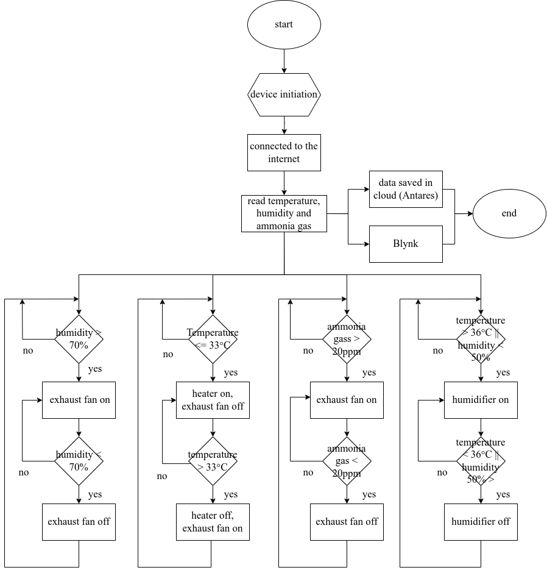
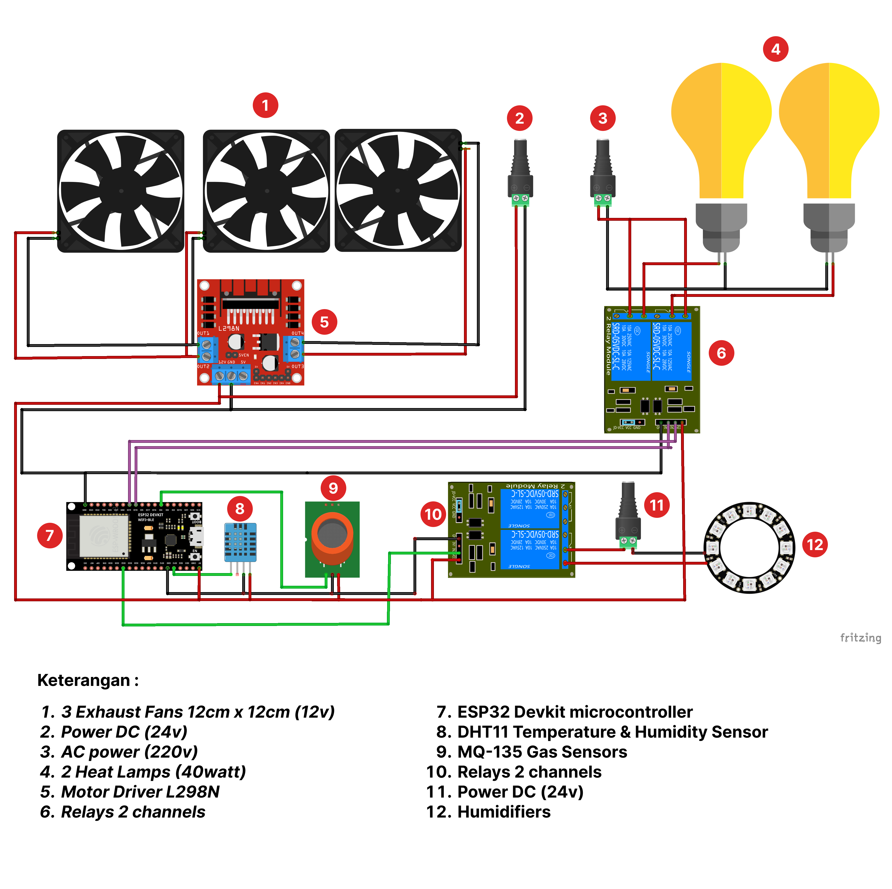
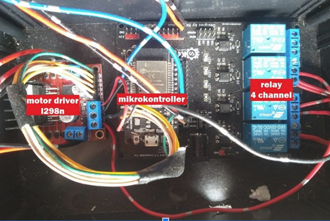
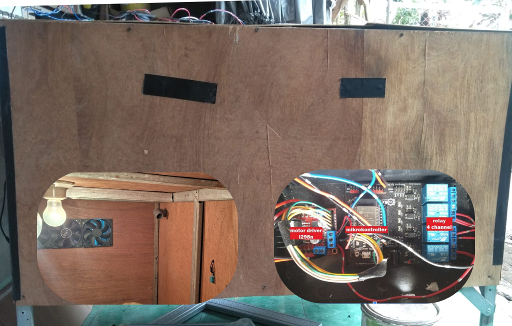

# Monitoring and Control of Air Quality using DHT11, MQ135 Sensors, and ESP32

## Overview

This project utilizes DHT11 and MQ135 sensors along with an ESP32 to monitor and control air quality. The system measures temperature, humidity, and air quality in real-time, providing a user-friendly interface for data visualization. Blynk is used for real-time monitoring, and Antares Cloud is employed to store sensor data.

## Hardware Requirements

-   ESP32 Development Board
-   DHT11 Temperature and Humidity Sensor
-   MQ135 Air Quality Sensor
-   Power Supply
-   Connecting Wires

## Software Requirements

-   Arduino IDE
-   ESP32 Board Support Package
-   DHT Library
-   MQ135 Library
-   Blynk Library
-   Antares IoT Cloud Account

## Installation

1. **Open the Arduino IDE.**

2. **Install the ESP32 Board Support Package.**
3. **Install the required libraries: DHT Library, MQ135 Library, Blynk Library.**

4. **Connect the hardware components following the [Hardware Setup](#hardware-setup) section.**

5. **Upload the code to your ESP32 board.**

## Flowchart

## Hardware Setup

Follow the steps in the Hardware Setup section of the documentation to properly connect the ESP32, DHT11, and MQ135.

## Usage

1. Power on the system.

2. Open the Arduino IDE Serial Monitor to view real-time data.

3. Access the Blynk app to monitor real-time data.

4. Data is stored on Antares Cloud for future analysis.

## Monitoring and Control Interface

Visit the Blynk app interface to monitor real-time data and control air quality devices. The interface provides features such as real-time data display, historical data analysis, and threshold alerts.

## Result

## Contributing

If you'd like to contribute to the project, please follow our [Contribution Guidelines](CONTRIBUTING.md).

## License

This project is licensed under the MIT License.
